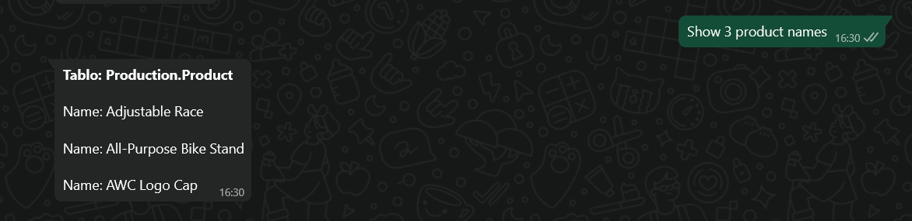
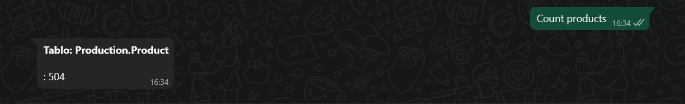
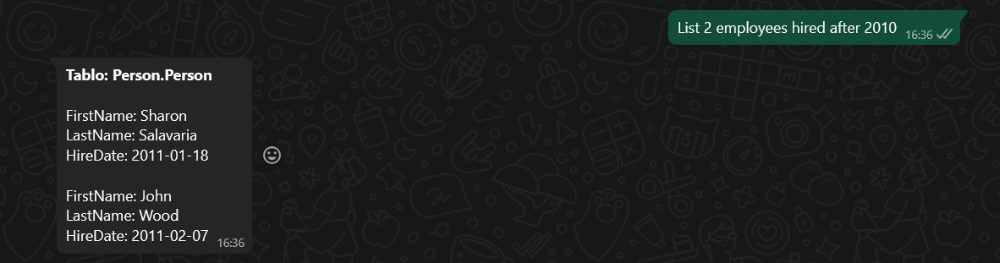

görüntüsünü oluşturacağım. README.md dosyasına "WhatsApp SQL Query Bot" başlığı altında, özellikler ve kullanılan teknolojiler bölümlerinden sonra "Ekran Görüntüleri" başlığı ekleyeceğim. Bu başlığın altına, belirtilen dosya yollarındaki ekran görüntülerini açıklayıcı alt yazılarla birlikte ekleyeceğim. Dosya yollarının doğru olduğundan emin olacağım ve görüntülerin README.md dosyasında düzgün bir şekilde görünmesini sağlayacağım.
\--\>

```markdown
# WhatsApp SQL Query Bot

A WhatsApp bot that converts user questions into SQL queries using Gemini AI, executes them on a SQL Server database, and sends the results back via WhatsApp.

---

## **Features**

- Ask questions via WhatsApp and get instant answers from your database.
- Uses AI to generate SQL queries from user messages.
- Automatically executes queries and formats results for WhatsApp.
- Handles long responses by splitting them into multiple messages.

---

## **Technologies Used**

- **Flask** – Web server and API
- **Twilio** – WhatsApp messaging integration
- **Google Gemini API** – AI-powered SQL generation
- **pyodbc** – SQL Server database connection
- **python-dotenv** – Environment variable management

---

## **Example Screenshots**








```
